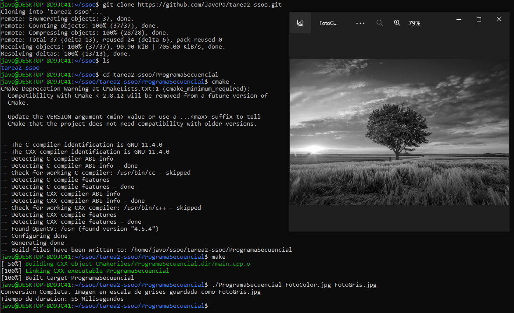
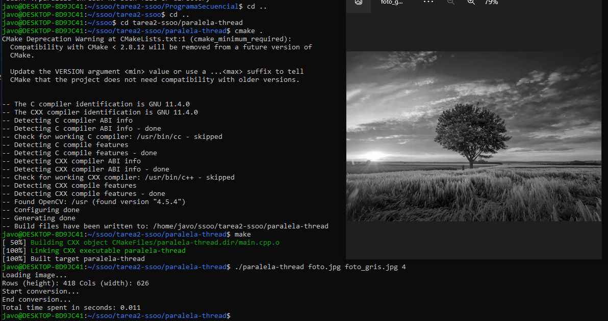
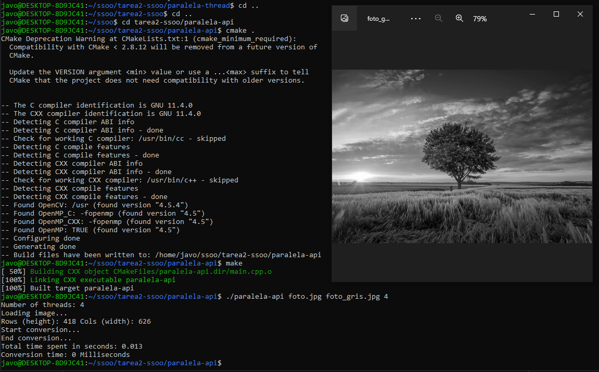

# tarea2-ssoo
Tarea 2: procesamiento paralelo

# Para la ejecución del programa, ejecutar los siguientes comandos:

## Instalación de paquetes (Linux Ubuntu/Debian):

`sudo apt update`

`sudo apt install libopencv-dev`

`sudo apt install build-essential`

`sudo apt install cmake`

## Creación de carpetas y ubicación:

`git clone https://github.com/JavoPa/tarea2-ssoo.git`

**Ubicarse en la carpeta de la implementación que quieras utilizar:**

`cd tarea2-ssoo/ProgramaSecuencial` para el programa secuencial,

o `cd tarea2-ssoo/paralela-thread` para el programa paralelo con threads

o `cd tarea2-ssoo/paralela-api` para el programa paralelo con la api OpenMP

## Compilación y ejecución:

**Estando ubicado en la carpeta del programa que quieras probar, ejecuta los siguientes comandos:**

`cmake .` para empaquetar el codigo CMakeLists

`make` para compilar el programa

**Para ejecutar el programa secuencial:**

`./ProgramaSecuencial FotoColor.jpg FotoGris.jpg`, donde FotoColor.jpg es la imagen original y FotoGris.jpg es la que se generará

**Para ejecutar las implementaciones paralelas:**

`./paralela-thread foto.jpg foto_gris.jpg 4`, donde `4` es el numero de hilos a ejecutar

`./paralela-api foto.jpg foto_gris.jpg 4`, donde `4` es el numero de hilos a ejecutar

Donde foto.jpg es la original y foto_gris.jpg es la que se generará.

----

# Capturas

## Foto original:

## Programa Secuencial:

## Implementación Paralela Threads:

## Implentación Paralela con API OpenMP:

